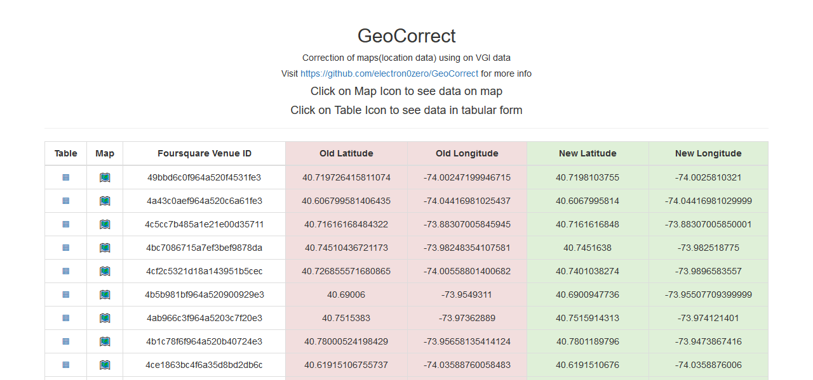
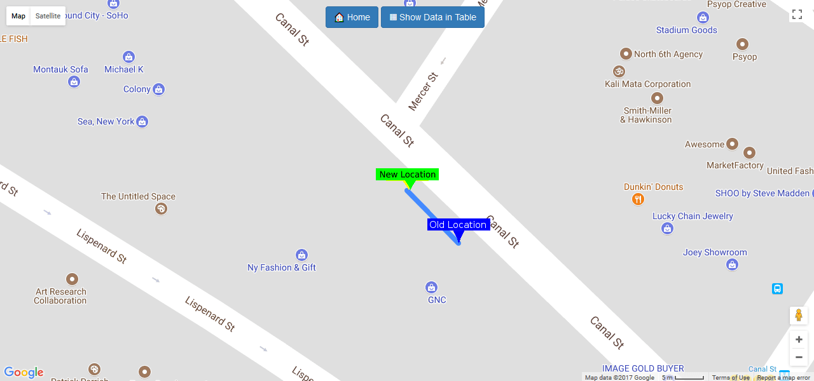
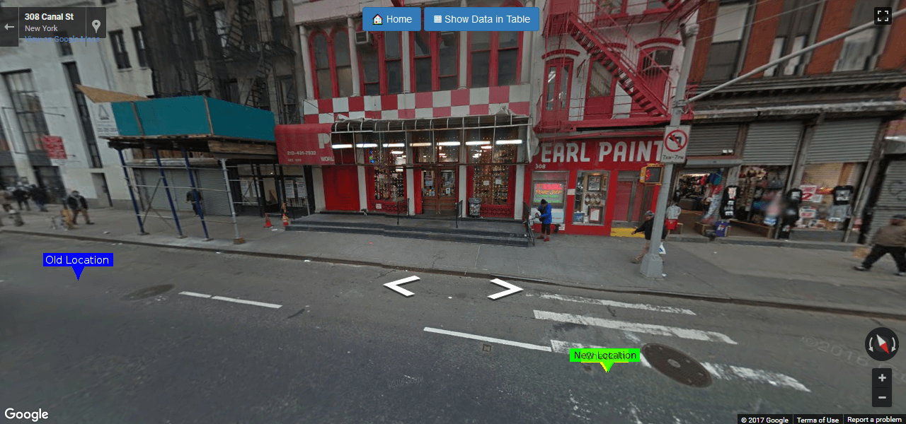
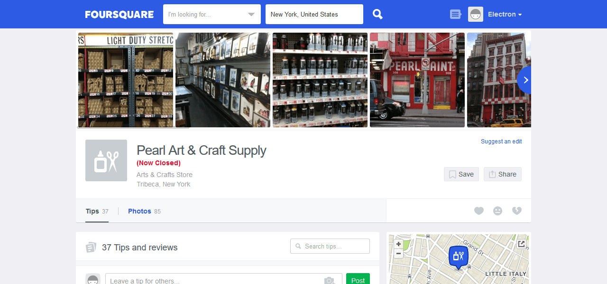
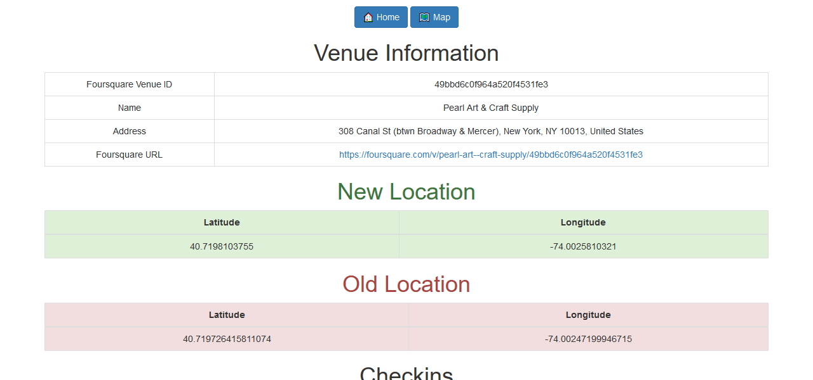

# GeoCorrect
Correction of maps(location data) using on VGI data

## Demo is live at [https://geocorrect.herokuapp.com/](https://geocorrect.herokuapp.com/) have a look

# Instructions

- clone this repo.
- Install [editorconfig](http://editorconfig.org/) plugin
- Must Follow [PEP-8](https://www.python.org/dev/peps/pep-0008/) style guide, [autopep8](https://github.com/hhatto/autopep8) can be handy
- Commit messages should be meaningful
- Work on feature branch, don't push on `master`. make a PR from feature branch to master

---

# Components
### folder structure
- algo : folder for algorithm
- clean: folder for our dataset(clean data + dirty data + data cleaning scripts) 
- docs : documentation
- web: flask based web application to visualize data

## Screenshots

